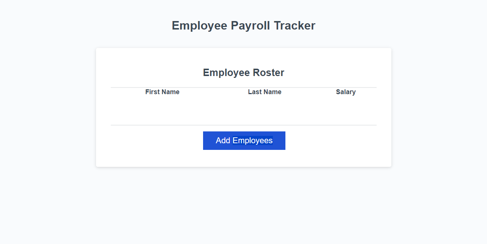
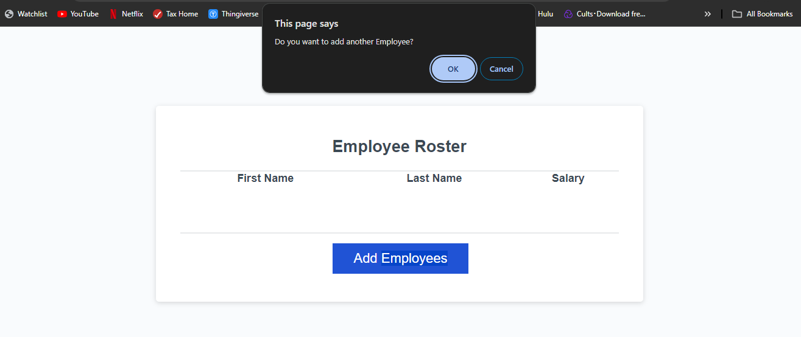
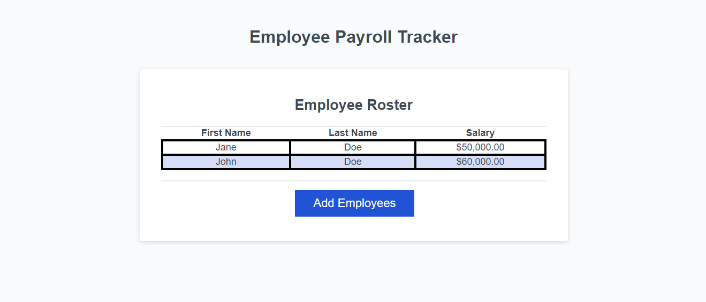
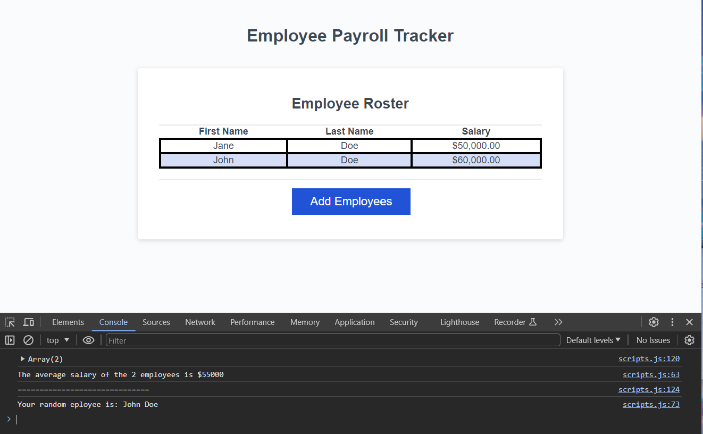

# Employee-Payroll-Tracker

## Description

This webpage is an Employee Payroll Tracker for the Rutgers Coding Bootcamp. The assignment was to use given code and to create three functions. The first function takes the data entered into the prompt and stores it in a object array. The second function takes the salaries stored in the object array, averages them, and logs them to the dev-tools console. This is acheved utilizing the built in reduce function. The third function pulls a random name from the object array and displayes it on the console using the Math.floor and Math.random functions. This assignment was very chanenging for me. Something that really stumped me was the fact that you can enter a falsy condition into a loop in order to make the loop stop. This was a great expierience and am very proud of myself for eventually being able to understand all the code that I wrote.

## Visuals

## Deployment

Provided as a link here - https://tirwin19.github.io/Employee-Payroll-Tracker/

## Usage

To use the webpage, To see what the JavaScript is loging to the console you can open the Chrome DevTools by pressing Command+Option+I (macOS) or Control+Shift+I (Windows). A console panel should open either below or to the side of the webpage in the browser. There you can navigate to the console tab to see the full object array returned by the collectEmployees(). Also displayed in the console is a message that gives the average of the employee salaries and also an employee name that is chosen randomly. 

## Credits

JD Tadlock - My Instructor for the Rutgers University Coding Bootcamp for all the help.

## License

Please refer to the LICENSE in the repo.
